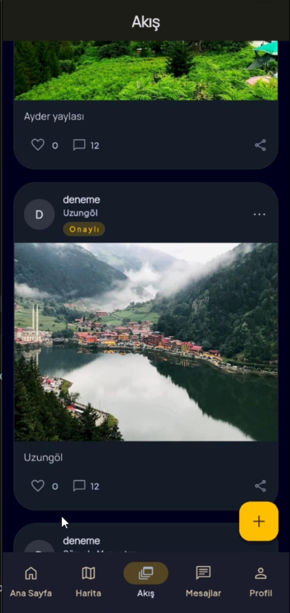
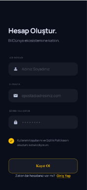
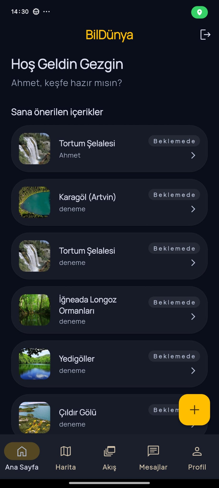
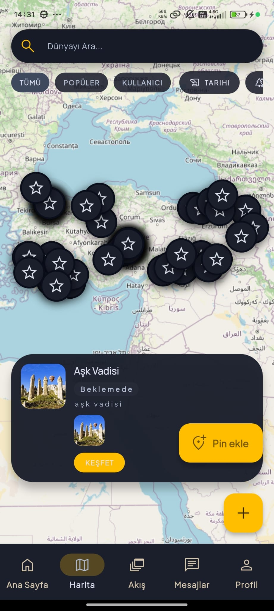
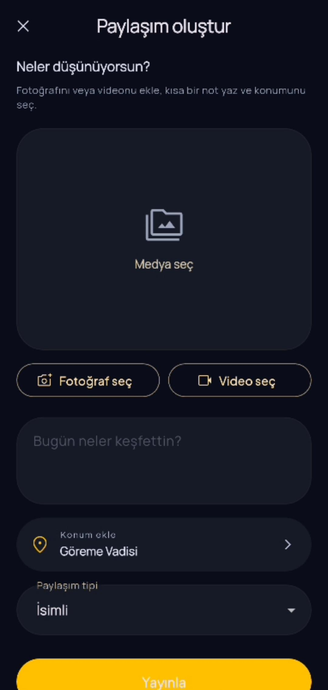
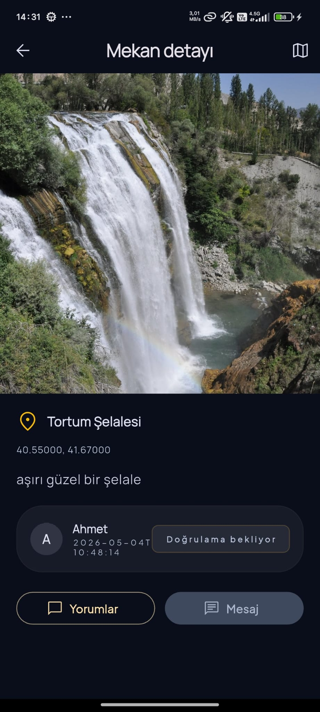
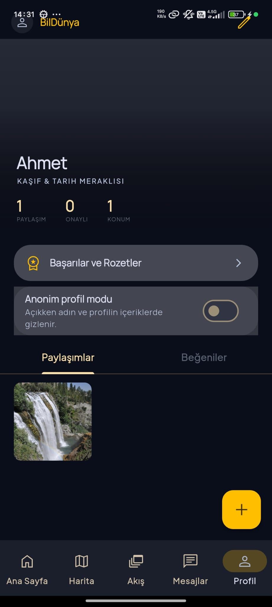
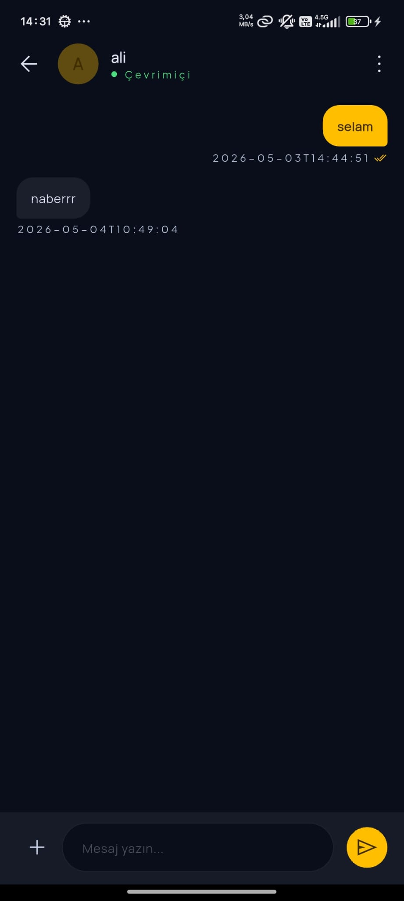

# BilDünya

BilDünya, dünya haritası üzerinden gezilen yerlerin fotoğraf ve video ile konum bağlamında paylaşıldığı, gezginlerin yorum ve sohbetle etkileşebildiği topluluk odaklı bir mobil keşif platformudur. Sosyal medyada dağınık kalan mekan içeriklerini harita merkezli ve doğrulanabilir bir yapıda bir araya getirmeyi hedefler. Depo; İnönü Üniversitesi **İnfest** kapsamındaki *turizm teknolojileri* başvurusunun uygulama bileşenlerini içerir; değerlendirme ve raporlama ayrıntıları yalnızca başvuru belgesindedir.

## Ekip

Başvuru formunda **4 kişi**: 1 danışman, 1 ekip kaptanı, 2 üye. Görev dağılımı (özet): mimari ve backend koordinasyonu; güvenlik, veri bütünlüğü ve doğrulama süreçleri; harita, sohbet ve profil arayüzleri. Kişisel isimler bu README’de yer almaz; tam liste başvuru belgesindedir.

## Kullanılan teknolojiler

### Mobil

- **Flutter** (Dart 3.11+): `dio`, `provider`, `flutter_secure_storage`, `flutter_map`, `cached_network_image`, `image_picker`, `stomp_dart_client` (WebSocket/STOMP), `google_fonts`

### Backend

- **Java 21**, **Spring Boot 3.3** (Web, Data JPA, Security, Validation, WebSocket)
- **PostgreSQL**, **JWT** (jjwt), **Swagger / OpenAPI** (springdoc)
- **Cloudinary** (medya), yerel dosya yükleme dizini

### Altyapı ve araçlar

- **Docker Compose** (geliştirme: PostgreSQL + backend konteyneri)
- İsteğe bağlı: **Neon** vb. barındırılan PostgreSQL; canlı örnek API için `ApiConfig` içindeki varsayılan taban adresi (`Render`)

## Ekran görüntüleri

_Görseller `resimler/` klasöründedir. Yerel önizlemede görelimiyorsa ham dosya adlarının (özellikle Türkçe karakter) UTF-8 ile aynı olduğundan emin olun._

### Karşılama

<p align="center">
  
</p>

### Uygulama akışı (özet)

<p align="center">
  
</p>

### Giriş ve kayıt

<p align="center">
  
  
  
</p>

### Ana sayfa ve harita

<p align="center">
  
  
</p>

### Paylaşım ve mekan detayı

<p align="center">
  
  
</p>

### Profil ve mesajlaşma

<p align="center">
  
  
</p>

## Depo yapısı (özet)

| Yol | Açıklama |
| --- | --- |
| `BilDunya/` | Spring Boot backend (`pom.xml`, `Dockerfile`, `docker-compose.yml`) |
| `bildunya_frontend/` | Flutter istemci |
| `expo-map-pins/`, `expo-place-chat/` | Ek React Native (Expo) deneyleri / yardımcı istemciler |
| `map-web/` | Harita odaklı web bileşenleri |
| `resimler/` | README ve tanıtım için ekran görüntüleri |
| `db/` | Veritabanı ile ilgili yardımcı dosyalar |

## Yerel çalıştırma ve dağıtım

### Backend (Spring Boot)

```bash
cd BilDunya
# PostgreSQL: docker-compose ile veya kendi örneğiniz
docker compose up -d postgresql   # yalnızca DB
# veya tam yığın
docker compose up --build
```

Önemli ortam değişkenleri (örnek; gerçek sırları repoya yazmayın): `SPRING_DATASOURCE_URL`, `SPRING_DATASOURCE_USERNAME`, `SPRING_DATASOURCE_PASSWORD`, `JWT_SECRET`, `JWT_EXPIRATION`, `ALLOWED_ORIGINS`, `CLOUDINARY_URL`, `PORT`. API kök yolu varsayılan olarak `server.servlet.context-path=/api` altındadır (ör. `http://localhost:8080/api`).

### Flutter istemci

```bash
cd bildunya_frontend
flutter pub get
flutter run --dart-define=API_BASE_URL=http://127.0.0.1:8080/api
```

Android emülatörden makineye erişim için genelde `http://10.0.2.2:8080/api` kullanılır. Canlı backend için `API_BASE_URL` değerini kendi dağıtımınıza göre verin. WebSocket adresi için isteğe bağlı: `--dart-define=API_WS_URL=...`

Varsayılan `API_BASE_URL` kodda tanımlıdır (`bildunya_frontend/lib/core/constants/api_config.dart`); yerel geliştirmede `--dart-define` ile ezmeniz gerekir.

## Lisans ve iletişim

Bu depoda henüz bir açık kaynak lisans dosyası bulunmamaktadır; kullanım koşulları için proje sahipleriyle iletişime geçin.
